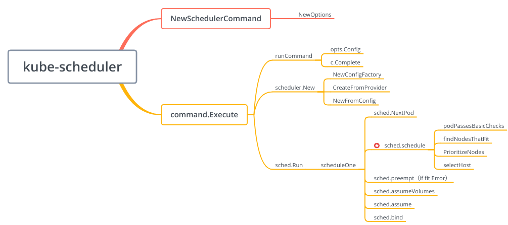
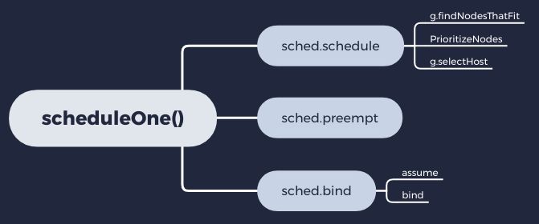

# kubernetes源码分析（一）何谓调度

kube-scheduler负责kubernetes的Pod调度，策略丰富且采用插件化设计，主要功能包括：

- Leader选主，确保集群中只有一个scheduler工作，其它只做高可用备份
- Node筛选，根据所设置的要求，选择出最合适的节点并调度（支持删除低优先级Pod，释放资源并分配给高优先级Pod）


> 以下代码分析基于 ***kubernetes v1.15.3*** 版本


## 总体结构



kube-scheduler结合用户的配置参数和默认设置生成scheduler，并监听Pod队列，如果有待调度Pod，即执行调度逻辑，其中，标星部分`sched.schedule`实现了包括预选、优选、抢占和绑定节点等算法，是整个调度逻辑的核心。


## 流程分解

在本章 **何谓调度** 中，我们将针对调度服务涉及的几个关键部分的代码实现逻辑进行简要说明。


### 1. 主函数 

kube-scheduler源码的主函数入口位于 `cmd/kube-scheduler/scheduler.go` ，目录结构如下：

```go
kube-scheduler
|--BUILD
|--OWNERS
|--app
|   |--BUILD
|   |--config
|   |   |--BUILD
|   |   |--config.go
|   |--options
|   |   |--BUILD
|   |   |--configfile.go
|   |   |--deprecated.go
|   |   |--deprecated_test.go
|   |   |--insecure_serving.go
|   |   |--insecure_serving_test.go
|   |   |--options.go
|   |   |--options_test.go
|   |--server.go
|   |--testing
|   |   |--BUILD
|   |   |--testserver.go
|--scheduler.go //主函数入口
```

kube-scheduler在入口函数`main()`处采用`github.com/spf13/cobra`作为统一的命令行框架

```go
func main() {
	rand.Seed(time.Now().UnixNano())

    // 创建*cobra.Command
	command := app.NewSchedulerCommand()

	// TODO: once we switch everything over to Cobra commands, we can go back to calling
	// utilflag.InitFlags() (by removing its pflag.Parse() call). For now, we have to set the
	// normalize func and add the go flag set by hand.
	pflag.CommandLine.SetNormalizeFunc(cliflag.WordSepNormalizeFunc)
	// utilflag.InitFlags()
	logs.InitLogs()
	defer logs.FlushLogs()

    //执行cmd.Run函数
	if err := command.Execute(); err != nil {
		os.Exit(1)
	}
}
```
`NewSchedulerCommand()`主要用来构造和初始化SchedulerCommand

```go
// NewSchedulerCommand creates a *cobra.Command object with default parameters and registryOptions
func NewSchedulerCommand(registryOptions ...Option) *cobra.Command {
	opts, err := options.NewOptions() //构造scheduler的配置参数及默认值
	if err != nil {
		klog.Fatalf("unable to initialize command options: %v", err)
	}

	cmd := &cobra.Command{
		Use: "kube-scheduler",
		Long: `The Kubernetes scheduler is a policy-rich, topology-aware,
workload-specific function that significantly impacts availability, performance,
and capacity. The scheduler needs to take into account individual and collective
resource requirements, quality of service requirements, hardware/software/policy
constraints, affinity and anti-affinity specifications, data locality, inter-workload
interference, deadlines, and so on. Workload-specific requirements will be exposed
through the API as necessary.`,
		Run: func(cmd *cobra.Command, args []string) { //运行命令行执行的主函数
			if err := runCommand(cmd, args, opts, registryOptions...); err != nil {
				fmt.Fprintf(os.Stderr, "%v\n", err)
				os.Exit(1)
			}
		},
	}
	fs := cmd.Flags()
	namedFlagSets := opts.Flags()
	verflag.AddFlags(namedFlagSets.FlagSet("global"))
	globalflag.AddGlobalFlags(namedFlagSets.FlagSet("global"), cmd.Name())
	for _, f := range namedFlagSets.FlagSets {
		fs.AddFlagSet(f)
	}

	usageFmt := "Usage:\n  %s\n"
	cols, _, _ := term.TerminalSize(cmd.OutOrStdout())
	cmd.SetUsageFunc(func(cmd *cobra.Command) error {
		fmt.Fprintf(cmd.OutOrStderr(), usageFmt, cmd.UseLine())
		cliflag.PrintSections(cmd.OutOrStderr(), namedFlagSets, cols)
		return nil
	})
	cmd.SetHelpFunc(func(cmd *cobra.Command, args []string) {
		fmt.Fprintf(cmd.OutOrStdout(), "%s\n\n"+usageFmt, cmd.Long, cmd.UseLine())
		cliflag.PrintSections(cmd.OutOrStdout(), namedFlagSets, cols)
	})
	cmd.MarkFlagFilename("config", "yaml", "yml", "json")

	return cmd
}
```

> cobra是一款非常优秀的命令行框架，建议学习使用


### 2. 配置Scheduler

kube-scheduler的配置多且复杂，以下是scheduler大致的构造生成逻辑


#### 2.1 构造配置参数

构造scheduler的配置参数及默认值

```go
opts, err := options.NewOptions() //构造scheduler的配置参数及默认值
```


具体代码如下：

> 代码路径：cmd/kube-scheduler/app/options/options.go

```go
// NewOptions returns default scheduler app options.
func NewOptions() (*Options, error) {
	cfg, err := newDefaultComponentConfig()
	if err != nil {
		return nil, err
	}

	hhost, hport, err := splitHostIntPort(cfg.HealthzBindAddress)
	if err != nil {
		return nil, err
	}

	o := &Options{
		ComponentConfig: *cfg,
		SecureServing:   apiserveroptions.NewSecureServingOptions().WithLoopback(),
		CombinedInsecureServing: &CombinedInsecureServingOptions{
			Healthz: (&apiserveroptions.DeprecatedInsecureServingOptions{
				BindNetwork: "tcp",
			}).WithLoopback(),
			Metrics: (&apiserveroptions.DeprecatedInsecureServingOptions{
				BindNetwork: "tcp",
			}).WithLoopback(),
			BindPort:    hport,
			BindAddress: hhost,
		},
		Authentication: apiserveroptions.NewDelegatingAuthenticationOptions(),
		Authorization:  apiserveroptions.NewDelegatingAuthorizationOptions(),
		Deprecated: &DeprecatedOptions{
			UseLegacyPolicyConfig:    false,
			PolicyConfigMapNamespace: metav1.NamespaceSystem,
		},
	}

	o.Authentication.TolerateInClusterLookupFailure = true
	o.Authentication.RemoteKubeConfigFileOptional = true
	o.Authorization.RemoteKubeConfigFileOptional = true
	o.Authorization.AlwaysAllowPaths = []string{"/healthz"}

	// Set the PairName but leave certificate directory blank to generate in-memory by default
	o.SecureServing.ServerCert.CertDirectory = ""
	o.SecureServing.ServerCert.PairName = "kube-scheduler"
	o.SecureServing.BindPort = ports.KubeSchedulerPort

	return o, nil
}
```


#### 2.2 构造配置对象

构造scheduler的配置对象（包括client, recorder, informerFactory等），并初始化

```go
c, err := opts.Config()
```


具体代码如下：

```go
// runCommand runs the scheduler.
func runCommand(cmd *cobra.Command, args []string, opts *options.Options, registryOptions ...Option) error {
	verflag.PrintAndExitIfRequested()
	utilflag.PrintFlags(cmd.Flags())

	if len(args) != 0 {
		fmt.Fprint(os.Stderr, "arguments are not supported\n")
	}

	if errs := opts.Validate(); len(errs) > 0 {
		fmt.Fprintf(os.Stderr, "%v\n", utilerrors.NewAggregate(errs))
		os.Exit(1)
	}

	if len(opts.WriteConfigTo) > 0 {
		if err := options.WriteConfigFile(opts.WriteConfigTo, &opts.ComponentConfig); err != nil {
			fmt.Fprintf(os.Stderr, "%v\n", err)
			os.Exit(1)
		}
		klog.Infof("Wrote configuration to: %s\n", opts.WriteConfigTo)
	}

	c, err := opts.Config() //构造scheduler的配置对象
	if err != nil {
		fmt.Fprintf(os.Stderr, "%v\n", err)
		os.Exit(1)
	}

	stopCh := make(chan struct{})
	// Get the completed config
	cc := c.Complete()

	// To help debugging, immediately log version
	klog.Infof("Version: %+v", version.Get())

	// Apply algorithms based on feature gates.
	// TODO: make configurable?
	algorithmprovider.ApplyFeatureGates()

	// Configz registration.
	if cz, err := configz.New("componentconfig"); err == nil {
		cz.Set(cc.ComponentConfig)
	} else {
		return fmt.Errorf("unable to register configz: %s", err)
	}

	return Run(cc, stopCh, registryOptions...) //构建scheduler, 初始化，并运行常驻进程
}
```


构造scheduler的配置对象

> 代码路径：cmd/kube-scheduler/app/options/options.go

```go
// Config return a scheduler config object
func (o *Options) Config() (*schedulerappconfig.Config, error) {
	if o.SecureServing != nil {
		if err := o.SecureServing.MaybeDefaultWithSelfSignedCerts("localhost", nil, []net.IP{net.ParseIP("127.0.0.1")}); err != nil {
			return nil, fmt.Errorf("error creating self-signed certificates: %v", err)
		}
	}

	c := &schedulerappconfig.Config{} //schedulerappconfig.Config数据结构
	if err := o.ApplyTo(c); err != nil {
		return nil, err
	}

	// Prepare kube clients.
	client, leaderElectionClient, eventClient, err := createClients(c.ComponentConfig.ClientConnection, o.Master, c.ComponentConfig.LeaderElection.RenewDeadline.Duration) //构造client,用于与kube-apiserver通信
	if err != nil {
		return nil, err
	}

	// Prepare event clients.
	eventBroadcaster := events.NewBroadcaster(&events.EventSinkImpl{Interface: eventClient.EventsV1beta1().Events("")})
	recorder := eventBroadcaster.NewRecorder(scheme.Scheme, c.ComponentConfig.SchedulerName)
	leaderElectionBroadcaster := record.NewBroadcaster()
	leaderElectionRecorder := leaderElectionBroadcaster.NewRecorder(scheme.Scheme, corev1.EventSource{Component: c.ComponentConfig.SchedulerName})

	// Set up leader election if enabled.
	var leaderElectionConfig *leaderelection.LeaderElectionConfig
	if c.ComponentConfig.LeaderElection.LeaderElect {
		leaderElectionConfig, err = makeLeaderElectionConfig(c.ComponentConfig.LeaderElection, leaderElectionClient, leaderElectionRecorder)
		if err != nil {
			return nil, err
		}
	}

	c.Client = client
	c.InformerFactory = informers.NewSharedInformerFactory(client, 0) //用于构造各类Informer
	c.PodInformer = factory.NewPodInformer(client, 0)
	c.EventClient = eventClient.EventsV1beta1() //
	c.CoreEventClient = eventClient.CoreV1()
	c.Recorder = recorder // recorder记录发生的事件
	c.Broadcaster = eventBroadcaster //broadcaster接收并广播事件，并发送到后端处理
	c.LeaderElectionBroadcaster = leaderElectionBroadcaster
	c.LeaderElection = leaderElectionConfig

	return c, nil
}
```

> 注：Recorder/EventBroadcaster，和Informer，涉及kubernetes通用且重要的事件机制和异步消息机制，这部分内容将在后续章节中详述


####  2.3 构造调度服务

构造scheduler， 初始化，并运行常驻进程

```go
Run(cc, stopCh, registryOptions...)
```


具体代码如下：

>代码路径：cmd/kube-scheduler/app/server.go

```go
// Run executes the scheduler based on the given configuration. It only return on error or when stopCh is closed.
func Run(cc schedulerserverconfig.CompletedConfig, stopCh <-chan struct{}, registryOptions ...Option) error {
	// To help debugging, immediately log version
	klog.V(1).Infof("Starting Kubernetes Scheduler version %+v", version.Get())

	registry := framework.NewRegistry()
	for _, option := range registryOptions {
		if err := option(registry); err != nil {
			return err
		}
	}

	// Create the scheduler. 构建scheduler
	sched, err := scheduler.New(cc.Client,
		cc.InformerFactory.Core().V1().Nodes(),
		cc.PodInformer,
		cc.InformerFactory.Core().V1().PersistentVolumes(),
		cc.InformerFactory.Core().V1().PersistentVolumeClaims(),
		cc.InformerFactory.Core().V1().ReplicationControllers(),
		cc.InformerFactory.Apps().V1().ReplicaSets(),
		cc.InformerFactory.Apps().V1().StatefulSets(),
		cc.InformerFactory.Core().V1().Services(),
		cc.InformerFactory.Policy().V1beta1().PodDisruptionBudgets(),
		cc.InformerFactory.Storage().V1().StorageClasses(),
		cc.InformerFactory.Storage().V1beta1().CSINodes(),
		cc.Recorder,
		cc.ComponentConfig.AlgorithmSource,
		stopCh,
		registry,
		cc.ComponentConfig.Plugins,
		cc.ComponentConfig.PluginConfig,
		scheduler.WithName(cc.ComponentConfig.SchedulerName),
		scheduler.WithHardPodAffinitySymmetricWeight(cc.ComponentConfig.HardPodAffinitySymmetricWeight),
		scheduler.WithPreemptionDisabled(cc.ComponentConfig.DisablePreemption),
		scheduler.WithPercentageOfNodesToScore(cc.ComponentConfig.PercentageOfNodesToScore),
		scheduler.WithBindTimeoutSeconds(*cc.ComponentConfig.BindTimeoutSeconds))
	if err != nil {
		return err
	}

	// Prepare the event broadcaster.
	if cc.Broadcaster != nil && cc.EventClient != nil {
		cc.Broadcaster.StartRecordingToSink(stopCh)
	}
	if cc.LeaderElectionBroadcaster != nil && cc.CoreEventClient != nil {
		cc.LeaderElectionBroadcaster.StartRecordingToSink(&corev1.EventSinkImpl{Interface: cc.CoreEventClient.Events("")})
	}
	// Setup healthz checks.
	var checks []healthz.HealthChecker
	if cc.ComponentConfig.LeaderElection.LeaderElect {
		checks = append(checks, cc.LeaderElection.WatchDog)
	}

	// Start up the healthz server.
	if cc.InsecureServing != nil {
		separateMetrics := cc.InsecureMetricsServing != nil
		handler := buildHandlerChain(newHealthzHandler(&cc.ComponentConfig, separateMetrics, checks...), nil, nil)
		if err := cc.InsecureServing.Serve(handler, 0, stopCh); err != nil {
			return fmt.Errorf("failed to start healthz server: %v", err)
		}
	}
	if cc.InsecureMetricsServing != nil {
		handler := buildHandlerChain(newMetricsHandler(&cc.ComponentConfig), nil, nil)
		if err := cc.InsecureMetricsServing.Serve(handler, 0, stopCh); err != nil {
			return fmt.Errorf("failed to start metrics server: %v", err)
		}
	}
	if cc.SecureServing != nil {
		handler := buildHandlerChain(newHealthzHandler(&cc.ComponentConfig, false, checks...), cc.Authentication.Authenticator, cc.Authorization.Authorizer)
		// TODO: handle stoppedCh returned by c.SecureServing.Serve
		if _, err := cc.SecureServing.Serve(handler, 0, stopCh); err != nil {
			// fail early for secure handlers, removing the old error loop from above
			return fmt.Errorf("failed to start secure server: %v", err)
		}
	}

	// Start all informers.
	go cc.PodInformer.Informer().Run(stopCh)
	cc.InformerFactory.Start(stopCh)

	// Wait for all caches to sync before scheduling.
	cc.InformerFactory.WaitForCacheSync(stopCh)

	// Prepare a reusable runCommand function.
	run := func(ctx context.Context) {
		sched.Run()
		<-ctx.Done()
	}

	ctx, cancel := context.WithCancel(context.TODO()) // TODO once Run() accepts a context, it should be used here
	defer cancel()

	go func() {
		select {
		case <-stopCh:
			cancel()
		case <-ctx.Done():
		}
	}()

	// If leader election is enabled, runCommand via LeaderElector until done and exit.
	if cc.LeaderElection != nil {
		cc.LeaderElection.Callbacks = leaderelection.LeaderCallbacks{
			OnStartedLeading: run,
			OnStoppedLeading: func() {
				klog.Fatalf("leaderelection lost")
			},
		}
		leaderElector, err := leaderelection.NewLeaderElector(*cc.LeaderElection)
		if err != nil {
			return fmt.Errorf("couldn't create leader elector: %v", err)
		}

		leaderElector.Run(ctx)

		return fmt.Errorf("lost lease")
	}

	// Leader election is disabled, so runCommand inline until done.
	run(ctx)
	return fmt.Errorf("finished without leader elect")
}
```


构建scheduler 

> 代码路径：pkg/scheduler/scheduler.go

```go
// New returns a Scheduler
func New(client clientset.Interface,
	nodeInformer coreinformers.NodeInformer,
	podInformer coreinformers.PodInformer,
	pvInformer coreinformers.PersistentVolumeInformer,
	pvcInformer coreinformers.PersistentVolumeClaimInformer,
	replicationControllerInformer coreinformers.ReplicationControllerInformer,
	replicaSetInformer appsinformers.ReplicaSetInformer,
	statefulSetInformer appsinformers.StatefulSetInformer,
	serviceInformer coreinformers.ServiceInformer,
	pdbInformer policyinformers.PodDisruptionBudgetInformer,
	storageClassInformer storageinformersv1.StorageClassInformer,
	csiNodeInformer storageinformersv1beta1.CSINodeInformer,
	recorder events.EventRecorder,
	schedulerAlgorithmSource kubeschedulerconfig.SchedulerAlgorithmSource,
	stopCh <-chan struct{},
	registry framework.Registry,
	plugins *kubeschedulerconfig.Plugins,
	pluginConfig []kubeschedulerconfig.PluginConfig,
	opts ...func(o *schedulerOptions)) (*Scheduler, error) {

	options := defaultSchedulerOptions
	for _, opt := range opts {
		opt(&options)
	}
	// Set up the configurator which can create schedulers from configs.
	configurator := factory.NewConfigFactory(&factory.ConfigFactoryArgs{
		Client:                         client,
		NodeInformer:                   nodeInformer,
		PodInformer:                    podInformer,
		PvInformer:                     pvInformer,
		PvcInformer:                    pvcInformer,
		ReplicationControllerInformer:  replicationControllerInformer,
		ReplicaSetInformer:             replicaSetInformer,
		StatefulSetInformer:            statefulSetInformer,
		ServiceInformer:                serviceInformer,
		PdbInformer:                    pdbInformer,
		StorageClassInformer:           storageClassInformer,
		CSINodeInformer:                csiNodeInformer,
		HardPodAffinitySymmetricWeight: options.hardPodAffinitySymmetricWeight,
		DisablePreemption:              options.disablePreemption,
		PercentageOfNodesToScore:       options.percentageOfNodesToScore,
		BindTimeoutSeconds:             options.bindTimeoutSeconds,
		Registry:                       registry,
		Plugins:                        plugins,
		PluginConfig:                   pluginConfig,
	})
	var config *factory.Config
	source := schedulerAlgorithmSource
	switch {
	case source.Provider != nil:
		// Create the config from a named algorithm provider.
		sc, err := configurator.CreateFromProvider(*source.Provider)
		if err != nil {
			return nil, fmt.Errorf("couldn't create scheduler using provider %q: %v", *source.Provider, err)
		}
		config = sc
	case source.Policy != nil:
		// Create the config from a user specified policy source.
		// Implement Algorithm interface
		policy := &schedulerapi.Policy{}
		switch {
		case source.Policy.File != nil:
			if err := initPolicyFromFile(source.Policy.File.Path, policy); err != nil {
				return nil, err
			}
		case source.Policy.ConfigMap != nil:
			if err := initPolicyFromConfigMap(client, source.Policy.ConfigMap, policy); err != nil {
				return nil, err
			}
		}
		sc, err := configurator.CreateFromConfig(*policy)
		if err != nil {
			return nil, fmt.Errorf("couldn't create scheduler from policy: %v", err)
		}
		config = sc
	default:
		return nil, fmt.Errorf("unsupported algorithm source: %v", source)
	}
	// Additional tweaks to the config produced by the configurator.
	config.Recorder = recorder
	config.DisablePreemption = options.disablePreemption
	config.StopEverything = stopCh

	// Create the scheduler.
	sched := NewFromConfig(config)

	AddAllEventHandlers(sched, options.schedulerName, nodeInformer, podInformer, pvInformer, pvcInformer, serviceInformer, storageClassInformer, csiNodeInformer)
	return sched, nil
}
```


### 3. 运行Scheduler

scheduler以常驻进程形式监听调度队列，如果有待调度的Pod，即运行调度逻辑进行调度。

#### 3.1 初始化配置对象

初始化event broadcaster、health check server、all informers，在调度前等待cache同步，并完成选举


具体代码如下：

> 代码路径：cmd/kube-scheduler/app/server.go

```go
// Run executes the scheduler based on the given configuration. It only return on error or when stopCh is closed.
func Run(cc schedulerserverconfig.CompletedConfig, stopCh <-chan struct{}, registryOptions ...Option) error {
	
    ...
    
	// Prepare the event broadcaster.
	if cc.Broadcaster != nil && cc.EventClient != nil {
		cc.Broadcaster.StartRecordingToSink(stopCh)
	}
	if cc.LeaderElectionBroadcaster != nil && cc.CoreEventClient != nil {
		cc.LeaderElectionBroadcaster.StartRecordingToSink(&corev1.EventSinkImpl{Interface: cc.CoreEventClient.Events("")})
	}
	// Setup healthz checks.
	var checks []healthz.HealthChecker
	if cc.ComponentConfig.LeaderElection.LeaderElect {
		checks = append(checks, cc.LeaderElection.WatchDog)
	}

	// Start up the healthz server.
	if cc.InsecureServing != nil {
		separateMetrics := cc.InsecureMetricsServing != nil
		handler := buildHandlerChain(newHealthzHandler(&cc.ComponentConfig, separateMetrics, checks...), nil, nil)
		if err := cc.InsecureServing.Serve(handler, 0, stopCh); err != nil {
			return fmt.Errorf("failed to start healthz server: %v", err)
		}
	}
	if cc.InsecureMetricsServing != nil {
		handler := buildHandlerChain(newMetricsHandler(&cc.ComponentConfig), nil, nil)
		if err := cc.InsecureMetricsServing.Serve(handler, 0, stopCh); err != nil {
			return fmt.Errorf("failed to start metrics server: %v", err)
		}
	}
	if cc.SecureServing != nil {
		handler := buildHandlerChain(newHealthzHandler(&cc.ComponentConfig, false, checks...), cc.Authentication.Authenticator, cc.Authorization.Authorizer)
		// TODO: handle stoppedCh returned by c.SecureServing.Serve
		if _, err := cc.SecureServing.Serve(handler, 0, stopCh); err != nil {
			// fail early for secure handlers, removing the old error loop from above
			return fmt.Errorf("failed to start secure server: %v", err)
		}
	}

	// Start all informers.
	go cc.PodInformer.Informer().Run(stopCh)
	cc.InformerFactory.Start(stopCh)

	// Wait for all caches to sync before scheduling.
	cc.InformerFactory.WaitForCacheSync(stopCh)

    ...

	// If leader election is enabled, runCommand via LeaderElector until done and exit.
	if cc.LeaderElection != nil {
		cc.LeaderElection.Callbacks = leaderelection.LeaderCallbacks{
			OnStartedLeading: run,
			OnStoppedLeading: func() {
				klog.Fatalf("leaderelection lost")
			},
		}
		leaderElector, err := leaderelection.NewLeaderElector(*cc.LeaderElection)
		if err != nil {
			return fmt.Errorf("couldn't create leader elector: %v", err)
		}

		leaderElector.Run(ctx)

		return fmt.Errorf("lost lease")
	}

	// Leader election is disabled, so runCommand inline until done.
	run(ctx)
	return fmt.Errorf("finished without leader elect")
}
```


#### 3.2 运行调度服务

运行调度服务常驻进程


具体代码如下：

> 代码路径：cmd/kube-scheduler/app/server.go

```go
// Run executes the scheduler based on the given configuration. It only return on error or when stopCh is closed.
func Run(cc schedulerserverconfig.CompletedConfig, stopCh <-chan struct{}, registryOptions ...Option) error {

    ...
    
	// Prepare a reusable runCommand function.
	run := func(ctx context.Context) {
		sched.Run() //运行调度服务常驻进程
		<-ctx.Done()
	}

	ctx, cancel := context.WithCancel(context.TODO()) // TODO once Run() accepts a context, it should be used here
	defer cancel()

	go func() {
		select {
		case <-stopCh:
			cancel()
		case <-ctx.Done():
		}
	}()
    
    ...

	return fmt.Errorf("finished without leader elect")
}
```

```go

```


#### 3.3 监听待调度Pod

监听调度队列中是否有待调度Pod

```go
pod := sched.NextPod()
```


具体代码如下：

> pkg/scheduler/scheduler.go

```go
// Run begins watching and scheduling. It waits for cache to be synced, then starts a goroutine and returns immediately.
func (sched *Scheduler) Run() {
	if !sched.WaitForCacheSync() {
		return
	}

	go wait.Until(sched.scheduleOne, 0, sched.StopEverything) //持续监听调度队列
}
```


> 代码路径：pkg/scheduler/scheduler.go

```go
// scheduleOne does the entire scheduling workflow for a single pod.  It is serialized on the scheduling algorithm's host fitting.
func (sched *Scheduler) scheduleOne() {
	fwk := sched.Framework

	pod := sched.NextPod()
	// pod could be nil when schedulerQueue is closed
	if pod == nil {
		return
	}
	if pod.DeletionTimestamp != nil {
		sched.Recorder.Eventf(pod, nil, v1.EventTypeWarning, "FailedScheduling", "Scheduling", "skip schedule deleting pod: %v/%v", pod.Namespace, pod.Name)
		klog.V(3).Infof("Skip schedule deleting pod: %v/%v", pod.Namespace, pod.Name)
		return
	}
    
    ...
}
```


`sched.NextPod()`具体执行的函数

> 代码路径：pkg/scheduler/internal/queue/scheduling_queue.go

```go
// MakeNextPodFunc returns a function to retrieve the next pod from a given
// scheduling queue
func MakeNextPodFunc(queue SchedulingQueue) func() *v1.Pod {
	return func() *v1.Pod {
		pod, err := queue.Pop()
		if err == nil {
			klog.V(4).Infof("About to try and schedule pod %v/%v", pod.Namespace, pod.Name)
			return pod
		}
		klog.Errorf("Error while retrieving next pod from scheduling queue: %v", err)
		return nil
	}
}
```


### 4. 执行调度逻辑

调度逻辑是整个调度服务的核心，主要为Pod选择合适的Node，包括调度、抢占、绑定。



> 抢占触发条件：当前Pod无可调度节点，且开启允许抢占


调度主要流程如下：

- 从Pod队列中取出一个待调度的Pod
- 执行调度算法选择最合适的节点
- 如果调度失败，则尝试执行抢占
- 如果调度成功，将Pod绑定到已选择的节点上


具体代码如下：

> 代码路径：pkg/scheduler/scheduler.go

```go
// scheduleOne does the entire scheduling workflow for a single pod.  It is serialized on the scheduling algorithm's host fitting.
func (sched *Scheduler) scheduleOne() {
	fwk := sched.Framework

	pod := sched.NextPod()
	// pod could be nil when schedulerQueue is closed
	if pod == nil {
		return
	}
	if pod.DeletionTimestamp != nil {
		sched.Recorder.Eventf(pod, nil, v1.EventTypeWarning, "FailedScheduling", "Scheduling", "skip schedule deleting pod: %v/%v", pod.Namespace, pod.Name)
		klog.V(3).Infof("Skip schedule deleting pod: %v/%v", pod.Namespace, pod.Name)
		return
	}

	klog.V(3).Infof("Attempting to schedule pod: %v/%v", pod.Namespace, pod.Name)

	// Synchronously attempt to find a fit for the pod.
	start := time.Now()
	pluginContext := framework.NewPluginContext()
	scheduleResult, err := sched.schedule(pod, pluginContext) // 调度
	if err != nil {
		// preempt, with the expectation that the next time the pod is tried for scheduling it
		// schedule() may have failed because the pod would not fit on any host, so we try to
		// will fit due to the preemption. It is also possible that a different pod will schedule
		// into the resources that were preempted, but this is harmless.
		if fitError, ok := err.(*core.FitError); ok {
			if sched.DisablePreemption {
				klog.V(3).Infof("Pod priority feature is not enabled or preemption is disabled by scheduler configuration." +
					" No preemption is performed.")
			} else {
				preemptionStartTime := time.Now()
				sched.preempt(fwk, pod, fitError) // 抢占
				metrics.PreemptionAttempts.Inc()
				metrics.SchedulingAlgorithmPremptionEvaluationDuration.Observe(metrics.SinceInSeconds(preemptionStartTime))
				metrics.DeprecatedSchedulingAlgorithmPremptionEvaluationDuration.Observe(metrics.SinceInMicroseconds(preemptionStartTime))
				metrics.SchedulingLatency.WithLabelValues(metrics.PreemptionEvaluation).Observe(metrics.SinceInSeconds(preemptionStartTime))
				metrics.DeprecatedSchedulingLatency.WithLabelValues(metrics.PreemptionEvaluation).Observe(metrics.SinceInSeconds(preemptionStartTime))
			}
			// Pod did not fit anywhere, so it is counted as a failure. If preemption
			// succeeds, the pod should get counted as a success the next time we try to
			// schedule it. (hopefully)
			metrics.PodScheduleFailures.Inc()
		} else {
			klog.Errorf("error selecting node for pod: %v", err)
			metrics.PodScheduleErrors.Inc()
		}
		return
	}
	metrics.SchedulingAlgorithmLatency.Observe(metrics.SinceInSeconds(start))
	metrics.DeprecatedSchedulingAlgorithmLatency.Observe(metrics.SinceInMicroseconds(start))
	// Tell the cache to assume that a pod now is running on a given node, even though it hasn't been bound yet.
	// This allows us to keep scheduling without waiting on binding to occur.
	assumedPod := pod.DeepCopy()

	// Assume volumes first before assuming the pod.
	//
	// If all volumes are completely bound, then allBound is true and binding will be skipped.
	//
	// Otherwise, binding of volumes is started after the pod is assumed, but before pod binding.
	//
	// This function modifies 'assumedPod' if volume binding is required.
	allBound, err := sched.assumeVolumes(assumedPod, scheduleResult.SuggestedHost)
	if err != nil {
		klog.Errorf("error assuming volumes: %v", err)
		metrics.PodScheduleErrors.Inc()
		return
	}

	// Run "reserve" plugins.
	if sts := fwk.RunReservePlugins(pluginContext, assumedPod, scheduleResult.SuggestedHost); !sts.IsSuccess() {
		sched.recordSchedulingFailure(assumedPod, sts.AsError(), SchedulerError, sts.Message())
		metrics.PodScheduleErrors.Inc()
		return
	}

	// assume modifies `assumedPod` by setting NodeName=scheduleResult.SuggestedHost
	err = sched.assume(assumedPod, scheduleResult.SuggestedHost) // 假性绑定
	if err != nil {
		klog.Errorf("error assuming pod: %v", err)
		metrics.PodScheduleErrors.Inc()
		// trigger un-reserve plugins to clean up state associated with the reserved Pod
		fwk.RunUnreservePlugins(pluginContext, assumedPod, scheduleResult.SuggestedHost)
		return
	}
	// bind the pod to its host asynchronously (we can do this b/c of the assumption step above).
	go func() {
		// Bind volumes first before Pod
		if !allBound {
			err := sched.bindVolumes(assumedPod)
			if err != nil {
				klog.Errorf("error binding volumes: %v", err)
				metrics.PodScheduleErrors.Inc()
				// trigger un-reserve plugins to clean up state associated with the reserved Pod
				fwk.RunUnreservePlugins(pluginContext, assumedPod, scheduleResult.SuggestedHost)
				return
			}
		}

		// Run "permit" plugins.
		permitStatus := fwk.RunPermitPlugins(pluginContext, assumedPod, scheduleResult.SuggestedHost)
		if !permitStatus.IsSuccess() {
			var reason string
			if permitStatus.Code() == framework.Unschedulable {
				metrics.PodScheduleFailures.Inc()
				reason = v1.PodReasonUnschedulable
			} else {
				metrics.PodScheduleErrors.Inc()
				reason = SchedulerError
			}
			if forgetErr := sched.Cache().ForgetPod(assumedPod); forgetErr != nil {
				klog.Errorf("scheduler cache ForgetPod failed: %v", forgetErr)
			}
			// trigger un-reserve plugins to clean up state associated with the reserved Pod
			fwk.RunUnreservePlugins(pluginContext, assumedPod, scheduleResult.SuggestedHost)
			sched.recordSchedulingFailure(assumedPod, permitStatus.AsError(), reason, permitStatus.Message())
			return
		}

		// Run "prebind" plugins.
		preBindStatus := fwk.RunPreBindPlugins(pluginContext, assumedPod, scheduleResult.SuggestedHost)
		if !preBindStatus.IsSuccess() {
			var reason string
			if preBindStatus.Code() == framework.Unschedulable {
				metrics.PodScheduleFailures.Inc()
				reason = v1.PodReasonUnschedulable
			} else {
				metrics.PodScheduleErrors.Inc()
				reason = SchedulerError
			}
			if forgetErr := sched.Cache().ForgetPod(assumedPod); forgetErr != nil {
				klog.Errorf("scheduler cache ForgetPod failed: %v", forgetErr)
			}
			// trigger un-reserve plugins to clean up state associated with the reserved Pod
			fwk.RunUnreservePlugins(pluginContext, assumedPod, scheduleResult.SuggestedHost)
			sched.recordSchedulingFailure(assumedPod, preBindStatus.AsError(), reason, preBindStatus.Message())
			return
		}

		err := sched.bind(assumedPod, scheduleResult.SuggestedHost, pluginContext) // 绑定
		metrics.E2eSchedulingLatency.Observe(metrics.SinceInSeconds(start))
		metrics.DeprecatedE2eSchedulingLatency.Observe(metrics.SinceInMicroseconds(start))
		if err != nil {
			klog.Errorf("error binding pod: %v", err)
			metrics.PodScheduleErrors.Inc()
			// trigger un-reserve plugins to clean up state associated with the reserved Pod
			fwk.RunUnreservePlugins(pluginContext, assumedPod, scheduleResult.SuggestedHost)
			sched.recordSchedulingFailure(assumedPod, err, SchedulerError, fmt.Sprintf("Binding rejected: %v", err))
		} else {
			// Calculating nodeResourceString can be heavy. Avoid it if klog verbosity is below 2.
			if klog.V(2) {
				node, _ := sched.Cache().GetNodeInfo(scheduleResult.SuggestedHost)
				klog.Infof("pod %v/%v is bound successfully on node %q, %d nodes evaluated, %d nodes were found feasible. Bound node resource: %q.", assumedPod.Namespace, assumedPod.Name, scheduleResult.SuggestedHost, scheduleResult.EvaluatedNodes, scheduleResult.FeasibleNodes, nodeResourceString(node))
			}

			metrics.PodScheduleSuccesses.Inc()

			// Run "postbind" plugins.
			fwk.RunPostBindPlugins(pluginContext, assumedPod, scheduleResult.SuggestedHost)
		}
	}()
}
```


#### 4.1 调度

调度分为预选和优选，通过预选函数来判断每个节点是否适合被该Pod调度，通过优选打分从满足调度条件的节点中选择出最优的节点。

```go
scheduleResult, err := sched.schedule(pod, pluginContext)
```


具体代码如下：

> 代码路径：pkg/scheduler/scheduler.go

```go
// schedule implements the scheduling algorithm and returns the suggested result(host,
// evaluated nodes number,feasible nodes number).
func (sched *Scheduler) schedule(pod *v1.Pod, pluginContext *framework.PluginContext) (core.ScheduleResult, error) {
	result, err := sched.Algorithm.Schedule(pod, pluginContext) // 执行调度算法
	if err != nil {
		pod = pod.DeepCopy()
		sched.recordSchedulingFailure(pod, err, v1.PodReasonUnschedulable, err.Error())
		return core.ScheduleResult{}, err
	}
	return result, err
}
```


genericScheduler实现了ScheduleAlgorithm接口

> 代码路径：pkg/scheduler/core/generic_scheduler.go

```go
// Schedule tries to schedule the given pod to one of the nodes in the node list.
// If it succeeds, it will return the name of the node.
// If it fails, it will return a FitError error with reasons.
func (g *genericScheduler) Schedule(pod *v1.Pod, pluginContext *framework.PluginContext) (result ScheduleResult, err error) {
	trace := utiltrace.New("Scheduling", utiltrace.Field{Key: "namespace", Value: pod.Namespace}, utiltrace.Field{Key: "name", Value: pod.Name})
	defer trace.LogIfLong(100 * time.Millisecond)

	// check pod pvc/pv is available.
	if err := podPassesBasicChecks(pod, g.pvcLister); err != nil {
		return result, err
	}

	// Run "prefilter" plugins.
	preFilterStatus := g.framework.RunPreFilterPlugins(pluginContext, pod)
	if !preFilterStatus.IsSuccess() {
		return result, preFilterStatus.AsError()
	}

	numNodes := g.cache.NodeTree().NumNodes()
	if numNodes == 0 {
		return result, ErrNoNodesAvailable
	}

	if err := g.snapshot(); err != nil {
		return result, err
	}

	trace.Step("Basic checks done")
	startPredicateEvalTime := time.Now()
	filteredNodes, failedPredicateMap, filteredNodesStatuses, err := g.findNodesThatFit(pluginContext, pod) // 预选
	if err != nil {
		return result, err
	}

	// Run "postfilter" plugins.
	postfilterStatus := g.framework.RunPostFilterPlugins(pluginContext, pod, filteredNodes, filteredNodesStatuses)
	if !postfilterStatus.IsSuccess() {
		return result, postfilterStatus.AsError()
	}

	if len(filteredNodes) == 0 {
		return result, &FitError{
			Pod:                   pod,
			NumAllNodes:           numNodes,
			FailedPredicates:      failedPredicateMap,
			FilteredNodesStatuses: filteredNodesStatuses,
		}
	}
	trace.Step("Computing predicates done")
	metrics.SchedulingAlgorithmPredicateEvaluationDuration.Observe(metrics.SinceInSeconds(startPredicateEvalTime))
	metrics.DeprecatedSchedulingAlgorithmPredicateEvaluationDuration.Observe(metrics.SinceInMicroseconds(startPredicateEvalTime))
	metrics.SchedulingLatency.WithLabelValues(metrics.PredicateEvaluation).Observe(metrics.SinceInSeconds(startPredicateEvalTime))
	metrics.DeprecatedSchedulingLatency.WithLabelValues(metrics.PredicateEvaluation).Observe(metrics.SinceInSeconds(startPredicateEvalTime))

	startPriorityEvalTime := time.Now()
	// When only one node after predicate, just use it.
	if len(filteredNodes) == 1 {
		metrics.SchedulingAlgorithmPriorityEvaluationDuration.Observe(metrics.SinceInSeconds(startPriorityEvalTime))
		metrics.DeprecatedSchedulingAlgorithmPriorityEvaluationDuration.Observe(metrics.SinceInMicroseconds(startPriorityEvalTime))
		return ScheduleResult{
			SuggestedHost:  filteredNodes[0].Name,
			EvaluatedNodes: 1 + len(failedPredicateMap),
			FeasibleNodes:  1,
		}, nil
	}

	metaPrioritiesInterface := g.priorityMetaProducer(pod, g.nodeInfoSnapshot.NodeInfoMap)
	priorityList, err := PrioritizeNodes(pod, g.nodeInfoSnapshot.NodeInfoMap, metaPrioritiesInterface, g.prioritizers, filteredNodes, g.extenders, g.framework, pluginContext) // 优选
	if err != nil {
		return result, err
	}
	trace.Step("Prioritizing done")
	metrics.SchedulingAlgorithmPriorityEvaluationDuration.Observe(metrics.SinceInSeconds(startPriorityEvalTime))
	metrics.DeprecatedSchedulingAlgorithmPriorityEvaluationDuration.Observe(metrics.SinceInMicroseconds(startPriorityEvalTime))
	metrics.SchedulingLatency.WithLabelValues(metrics.PriorityEvaluation).Observe(metrics.SinceInSeconds(startPriorityEvalTime))
	metrics.DeprecatedSchedulingLatency.WithLabelValues(metrics.PriorityEvaluation).Observe(metrics.SinceInSeconds(startPriorityEvalTime))

	host, err := g.selectHost(priorityList) // 选择最合适的节点
	trace.Step("Selecting host done")
	return ScheduleResult{
		SuggestedHost:  host,
		EvaluatedNodes: len(filteredNodes) + len(failedPredicateMap),
		FeasibleNodes:  len(filteredNodes),
	}, err
}
```


**预选**，用于判断节点是否适合被调度，主要的默认算法包括：

```go
"CheckNodeConditionPredicate" // 检查Node状态是否处于可调度状态
"PodFitsHost" // 检查pod.spec.nodeName是否匹配
"PodFitsHostPorts" // 检查服务端口是否被占用
"PodMatchNodeSelector" // 检查label是否匹配
"PodFitsResources" // 检查Node的资源是否足够可用
"NoDiskConflict" // 检查是否有存储冲突
"PodToleratesNodeTaints" // 检查Node是否容忍taint环境
"PodToleratesNodeNoExecuteTaints" // 检查Node是否容忍taint环境
"checkServiceAffinity" // 检查服务亲和性
"CheckNodeMemoryPressurePredicate" // 检查Node内存压力
"VolumeZonePredicate" // 检查存储域划分
"MaxPDVolumeCountPredicate" //检查挂载的逻辑卷个数是否超标

```

```go
filteredNodes, failedPredicateMap, filteredNodesStatuses, err := g.findNodesThatFit(pluginContext, pod)
```


具体代码如下：

> 代码路径：pkg/scheduler/core/generic_scheduler.go

```go
// Filters the nodes to find the ones that fit based on the given predicate functions
// Each node is passed through the predicate functions to determine if it is a fit
func (g *genericScheduler) findNodesThatFit(pluginContext *framework.PluginContext, pod *v1.Pod) ([]*v1.Node, FailedPredicateMap, framework.NodeToStatusMap, error) {
	var filtered []*v1.Node
	failedPredicateMap := FailedPredicateMap{}
	filteredNodesStatuses := framework.NodeToStatusMap{}

	if len(g.predicates) == 0 {
		filtered = g.cache.ListNodes()
	} else {
		allNodes := int32(g.cache.NodeTree().NumNodes())
		numNodesToFind := g.numFeasibleNodesToFind(allNodes)

		// Create filtered list with enough space to avoid growing it
		// and allow assigning.
		filtered = make([]*v1.Node, numNodesToFind)
		errs := errors.MessageCountMap{}
		var (
			predicateResultLock sync.Mutex
			filteredLen         int32
		)

		ctx, cancel := context.WithCancel(context.Background())

		// We can use the same metadata producer for all nodes.
		meta := g.predicateMetaProducer(pod, g.nodeInfoSnapshot.NodeInfoMap)

		checkNode := func(i int) {
			nodeName := g.cache.NodeTree().Next()

			fits, failedPredicates, err := podFitsOnNode(
				pod,
				meta,
				g.nodeInfoSnapshot.NodeInfoMap[nodeName],
				g.predicates,
				g.schedulingQueue,
				g.alwaysCheckAllPredicates,
			)
			if err != nil {
				predicateResultLock.Lock()
				errs[err.Error()]++
				predicateResultLock.Unlock()
				return
			}
			if fits {
				// Iterate each plugin to verify current node
				status := g.framework.RunFilterPlugins(pluginContext, pod, nodeName)
				if !status.IsSuccess() {
					predicateResultLock.Lock()
					filteredNodesStatuses[nodeName] = status
					if status.Code() != framework.Unschedulable {
						errs[status.Message()]++
					}
					predicateResultLock.Unlock()
					return
				}

				length := atomic.AddInt32(&filteredLen, 1)
				if length > numNodesToFind {
					cancel()
					atomic.AddInt32(&filteredLen, -1)
				} else {
					filtered[length-1] = g.nodeInfoSnapshot.NodeInfoMap[nodeName].Node()
				}
			} else {
				predicateResultLock.Lock()
				failedPredicateMap[nodeName] = failedPredicates
				predicateResultLock.Unlock()
			}
		}

		// Stops searching for more nodes once the configured number of feasible nodes
		// are found.
		workqueue.ParallelizeUntil(ctx, 16, int(allNodes), checkNode)

		filtered = filtered[:filteredLen]
		if len(errs) > 0 {
			return []*v1.Node{}, FailedPredicateMap{}, framework.NodeToStatusMap{}, errors.CreateAggregateFromMessageCountMap(errs)
		}
	}

	if len(filtered) > 0 && len(g.extenders) != 0 {
		for _, extender := range g.extenders {
			if !extender.IsInterested(pod) {
				continue
			}
			filteredList, failedMap, err := extender.Filter(pod, filtered, g.nodeInfoSnapshot.NodeInfoMap)
			if err != nil {
				if extender.IsIgnorable() {
					klog.Warningf("Skipping extender %v as it returned error %v and has ignorable flag set",
						extender, err)
					continue
				}

				return []*v1.Node{}, FailedPredicateMap{}, framework.NodeToStatusMap{}, err
			}

			for failedNodeName, failedMsg := range failedMap {
				if _, found := failedPredicateMap[failedNodeName]; !found {
					failedPredicateMap[failedNodeName] = []predicates.PredicateFailureReason{}
				}
				failedPredicateMap[failedNodeName] = append(failedPredicateMap[failedNodeName], predicates.NewFailureReason(failedMsg))
			}
			filtered = filteredList
			if len(filtered) == 0 {
				break
			}
		}
	}
	return filtered, failedPredicateMap, filteredNodesStatuses, nil
}
```


**优选**，用于给可被调度的节点打分，主要的默认算法包括：

```go
"SelectorSpreadPriority" // 使每个Node具有相同服务或RC的Pod尽量少
"InterPodAffinityPriority" // 根据Pod共性，如node,zone,domain等分配
"LeastRequestedPriority" // 选择最空闲的Node
"BalancedResourceAllocation" // 保持Node资源分配平衡
"NodePreferAvoidPodsPriority" // 根据用户自定义的权重分配
"NodeAffinityPriority" // 根据节点关系分配
"TaintTolerationPriority" // 根据Pod设置的Toleration分配
```

```go
priorityList, err := PrioritizeNodes(pod, g.nodeInfoSnapshot.NodeInfoMap, metaPrioritiesInterface, g.prioritizers, filteredNodes, g.extenders, g.framework, pluginContext)
```


具体代码如下：

> pkg/scheduler/core/generic_scheduler.go

```go
// PrioritizeNodes prioritizes the nodes by running the individual priority functions in parallel.
// Each priority function is expected to set a score of 0-10
// 0 is the lowest priority score (least preferred node) and 10 is the highest
// Each priority function can also have its own weight
// The node scores returned by the priority function are multiplied by the weights to get weighted scores
// All scores are finally combined (added) to get the total weighted scores of all nodes
func PrioritizeNodes(
	pod *v1.Pod,
	nodeNameToInfo map[string]*schedulernodeinfo.NodeInfo,
	meta interface{},
	priorityConfigs []priorities.PriorityConfig,
	nodes []*v1.Node,
	extenders []algorithm.SchedulerExtender,
	framework framework.Framework,
	pluginContext *framework.PluginContext) (schedulerapi.HostPriorityList, error) {
	// If no priority configs are provided, then the EqualPriority function is applied
	// This is required to generate the priority list in the required format
	if len(priorityConfigs) == 0 && len(extenders) == 0 {
		result := make(schedulerapi.HostPriorityList, 0, len(nodes))
		for i := range nodes {
			hostPriority, err := EqualPriorityMap(pod, meta, nodeNameToInfo[nodes[i].Name])
			if err != nil {
				return nil, err
			}
			result = append(result, hostPriority)
		}
		return result, nil
	}

	var (
		mu   = sync.Mutex{}
		wg   = sync.WaitGroup{}
		errs []error
	)
	appendError := func(err error) {
		mu.Lock()
		defer mu.Unlock()
		errs = append(errs, err)
	}

	results := make([]schedulerapi.HostPriorityList, len(priorityConfigs), len(priorityConfigs))

	// DEPRECATED: we can remove this when all priorityConfigs implement the
	// Map-Reduce pattern.
	for i := range priorityConfigs {
		if priorityConfigs[i].Function != nil {
			wg.Add(1)
			go func(index int) {
				defer wg.Done()
				var err error
				results[index], err = priorityConfigs[index].Function(pod, nodeNameToInfo, nodes)
				if err != nil {
					appendError(err)
				}
			}(i)
		} else {
			results[i] = make(schedulerapi.HostPriorityList, len(nodes))
		}
	}

	workqueue.ParallelizeUntil(context.TODO(), 16, len(nodes), func(index int) {
		nodeInfo := nodeNameToInfo[nodes[index].Name]
		for i := range priorityConfigs {
			if priorityConfigs[i].Function != nil {
				continue
			}

			var err error
			results[i][index], err = priorityConfigs[i].Map(pod, meta, nodeInfo)
			if err != nil {
				appendError(err)
				results[i][index].Host = nodes[index].Name
			}
		}
	})

	for i := range priorityConfigs {
		if priorityConfigs[i].Reduce == nil {
			continue
		}
		wg.Add(1)
		go func(index int) {
			defer wg.Done()
			if err := priorityConfigs[index].Reduce(pod, meta, nodeNameToInfo, results[index]); err != nil {
				appendError(err)
			}
			if klog.V(10) {
				for _, hostPriority := range results[index] {
					klog.Infof("%v -> %v: %v, Score: (%d)", util.GetPodFullName(pod), hostPriority.Host, priorityConfigs[index].Name, hostPriority.Score)
				}
			}
		}(i)
	}
	// Wait for all computations to be finished.
	wg.Wait()
	if len(errs) != 0 {
		return schedulerapi.HostPriorityList{}, errors.NewAggregate(errs)
	}

	// Run the Score plugins.
	scoresMap, scoreStatus := framework.RunScorePlugins(pluginContext, pod, nodes)
	if !scoreStatus.IsSuccess() {
		return schedulerapi.HostPriorityList{}, scoreStatus.AsError()
	}

	// Summarize all scores.
	result := make(schedulerapi.HostPriorityList, 0, len(nodes))

	for i := range nodes {
		result = append(result, schedulerapi.HostPriority{Host: nodes[i].Name, Score: 0})
		for j := range priorityConfigs {
			result[i].Score += results[j][i].Score * priorityConfigs[j].Weight
		}

		for j := range scoresMap {
			result[i].Score += scoresMap[j][i].Score
		}
	}

	if len(extenders) != 0 && nodes != nil {
		combinedScores := make(map[string]int, len(nodeNameToInfo))
		for i := range extenders {
			if !extenders[i].IsInterested(pod) {
				continue
			}
			wg.Add(1)
			go func(extIndex int) {
				defer wg.Done()
				prioritizedList, weight, err := extenders[extIndex].Prioritize(pod, nodes)
				if err != nil {
					// Prioritization errors from extender can be ignored, let k8s/other extenders determine the priorities
					return
				}
				mu.Lock()
				for i := range *prioritizedList {
					host, score := (*prioritizedList)[i].Host, (*prioritizedList)[i].Score
					if klog.V(10) {
						klog.Infof("%v -> %v: %v, Score: (%d)", util.GetPodFullName(pod), host, extenders[extIndex].Name(), score)
					}
					combinedScores[host] += score * weight
				}
				mu.Unlock()
			}(i)
		}
		// wait for all go routines to finish
		wg.Wait()
		for i := range result {
			result[i].Score += combinedScores[result[i].Host]
		}
	}

	if klog.V(10) {
		for i := range result {
			klog.Infof("Host %s => Score %d", result[i].Host, result[i].Score)
		}
	}
	return result, nil
}
```


#### 4.2 抢占

如果pod在预选和优选调度中失败，则执行抢占操作。抢占主要是将低优先级的pod的资源空间腾出给待调度的高优先级的pod。

```go
sched.preempt(fwk, pod, fitError)
```


具体代码如下：

> 代码路径：pkg/scheduler/core/generic_scheduler.go

```go
// preempt finds nodes with pods that can be preempted to make room for "pod" to
// schedule. It chooses one of the nodes and preempts the pods on the node and
// returns 1) the node, 2) the list of preempted pods if such a node is found,
// 3) A list of pods whose nominated node name should be cleared, and 4) any
// possible error.
// Preempt does not update its snapshot. It uses the same snapshot used in the
// scheduling cycle. This is to avoid a scenario where preempt finds feasible
// nodes without preempting any pod. When there are many pending pods in the
// scheduling queue a nominated pod will go back to the queue and behind
// other pods with the same priority. The nominated pod prevents other pods from
// using the nominated resources and the nominated pod could take a long time
// before it is retried after many other pending pods.
func (g *genericScheduler) Preempt(pod *v1.Pod, scheduleErr error) (*v1.Node, []*v1.Pod, []*v1.Pod, error) {
	// Scheduler may return various types of errors. Consider preemption only if
	// the error is of type FitError.
	fitError, ok := scheduleErr.(*FitError)
	if !ok || fitError == nil {
		return nil, nil, nil, nil
	}
	if !podEligibleToPreemptOthers(pod, g.nodeInfoSnapshot.NodeInfoMap, g.enableNonPreempting) {
		klog.V(5).Infof("Pod %v/%v is not eligible for more preemption.", pod.Namespace, pod.Name)
		return nil, nil, nil, nil
	}
	allNodes := g.cache.ListNodes()
	if len(allNodes) == 0 {
		return nil, nil, nil, ErrNoNodesAvailable
	}
	potentialNodes := nodesWherePreemptionMightHelp(allNodes, fitError.FailedPredicates)
	if len(potentialNodes) == 0 {
		klog.V(3).Infof("Preemption will not help schedule pod %v/%v on any node.", pod.Namespace, pod.Name)
		// In this case, we should clean-up any existing nominated node name of the pod.
		return nil, nil, []*v1.Pod{pod}, nil
	}
	pdbs, err := g.pdbLister.List(labels.Everything())
	if err != nil {
		return nil, nil, nil, err
	}
	nodeToVictims, err := selectNodesForPreemption(pod, g.nodeInfoSnapshot.NodeInfoMap, potentialNodes, g.predicates,
		g.predicateMetaProducer, g.schedulingQueue, pdbs)
	if err != nil {
		return nil, nil, nil, err
	}

	// We will only check nodeToVictims with extenders that support preemption.
	// Extenders which do not support preemption may later prevent preemptor from being scheduled on the nominated
	// node. In that case, scheduler will find a different host for the preemptor in subsequent scheduling cycles.
	nodeToVictims, err = g.processPreemptionWithExtenders(pod, nodeToVictims)
	if err != nil {
		return nil, nil, nil, err
	}

	candidateNode := pickOneNodeForPreemption(nodeToVictims)
	if candidateNode == nil {
		return nil, nil, nil, nil
	}

	// Lower priority pods nominated to run on this node, may no longer fit on
	// this node. So, we should remove their nomination. Removing their
	// nomination updates these pods and moves them to the active queue. It
	// lets scheduler find another place for them.
	nominatedPods := g.getLowerPriorityNominatedPods(pod, candidateNode.Name)
	if nodeInfo, ok := g.nodeInfoSnapshot.NodeInfoMap[candidateNode.Name]; ok {
		return nodeInfo.Node(), nodeToVictims[candidateNode].Pods, nominatedPods, nil
	}

	return nil, nil, nil, fmt.Errorf(
		"preemption failed: the target node %s has been deleted from scheduler cache",
		candidateNode.Name)
}
```


#### 4.3 绑定

绑定可分为假性绑定和真实绑定。

假性绑定，即将绑定关系存入缓存，继续执行调度逻辑，无需等待具体绑定操作。如果假性绑定成功，则发送请求给kube-apiserver，如果失败，则立即释放绑定关系及已分配的资源。

真实绑定，通过异步方式将pod绑定到指定节点上。


具体代码如下：

> 代码路径：pkg/scheduler/scheduler.go

```go
// scheduleOne does the entire scheduling workflow for a single pod.  It is serialized on the scheduling algorithm's host fitting.
func (sched *Scheduler) scheduleOne() {
	...
	// Tell the cache to assume that a pod now is running on a given node, even though it hasn't been bound yet.
	// This allows us to keep scheduling without waiting on binding to occur.
	assumedPod := pod.DeepCopy()

	// Assume volumes first before assuming the pod.
	//
	// If all volumes are completely bound, then allBound is true and binding will be skipped.
	//
	// Otherwise, binding of volumes is started after the pod is assumed, but before pod binding.
	//
	// This function modifies 'assumedPod' if volume binding is required.
	allBound, err := sched.assumeVolumes(assumedPod, scheduleResult.SuggestedHost)
	
    ...

	// assume modifies `assumedPod` by setting NodeName=scheduleResult.SuggestedHost
	err = sched.assume(assumedPod, scheduleResult.SuggestedHost)
	
    ...
    
	// bind the pod to its host asynchronously (we can do this b/c of the assumption step above).
	go func() {
		// Bind volumes first before Pod
		if !allBound {
			err := sched.bindVolumes(assumedPod)
			if err != nil {
				klog.Errorf("error binding volumes: %v", err)
				metrics.PodScheduleErrors.Inc()
				// trigger un-reserve plugins to clean up state associated with the reserved Pod
				fwk.RunUnreservePlugins(pluginContext, assumedPod, scheduleResult.SuggestedHost)
				return
			}
		}

		...

		err := sched.bind(assumedPod, scheduleResult.SuggestedHost, pluginContext)
		...
	}()
}
```


**假性绑定**

```go
err = sched.assume(assumedPod, scheduleResult.SuggestedHost)
```

具体代码如下：

> 代码路径：pkg/scheduler/scheduler.go

```go
// assume signals to the cache that a pod is already in the cache, so that binding can be asynchronous.
// assume modifies `assumed`.
func (sched *Scheduler) assume(assumed *v1.Pod, host string) error {
	// Optimistically assume that the binding will succeed and send it to apiserver
	// in the background.
	// If the binding fails, scheduler will release resources allocated to assumed pod
	// immediately.
	assumed.Spec.NodeName = host

	if err := sched.SchedulerCache.AssumePod(assumed); err != nil {
		klog.Errorf("scheduler cache AssumePod failed: %v", err)

		// This is most probably result of a BUG in retrying logic.
		// We report an error here so that pod scheduling can be retried.
		// This relies on the fact that Error will check if the pod has been bound
		// to a node and if so will not add it back to the unscheduled pods queue
		// (otherwise this would cause an infinite loop).
		sched.recordSchedulingFailure(assumed, err, SchedulerError,
			fmt.Sprintf("AssumePod failed: %v", err))
		return err
	}
	// if "assumed" is a nominated pod, we should remove it from internal cache
	if sched.SchedulingQueue != nil {
		sched.SchedulingQueue.DeleteNominatedPodIfExists(assumed)
	}

	return nil
}
```


**真实绑定**

```go
err := sched.bind(assumedPod, scheduleResult.SuggestedHost, pluginContext)
```

具体代码如下：

> 代码路径：pkg/scheduler/scheduler.go

```go
// bind binds a pod to a given node defined in a binding object.  We expect this to run asynchronously, so we
// handle binding metrics internally.
func (sched *Scheduler) bind(assumed *v1.Pod, targetNode string, pluginContext *framework.PluginContext) error {
	bindingStart := time.Now()
	bindStatus := sched.Framework.RunBindPlugins(pluginContext, assumed, targetNode)
	var err error
	if !bindStatus.IsSuccess() {
		if bindStatus.Code() == framework.Skip {
			// All bind plugins chose to skip binding of this pod, call original binding function.
			// If binding succeeds then PodScheduled condition will be updated in apiserver so that
			// it's atomic with setting host.
			err = sched.GetBinder(assumed).Bind(&v1.Binding{
				ObjectMeta: metav1.ObjectMeta{Namespace: assumed.Namespace, Name: assumed.Name, UID: assumed.UID},
				Target: v1.ObjectReference{
					Kind: "Node",
					Name: targetNode,
				},
			})
		} else {
			err = fmt.Errorf("Bind failure, code: %d: %v", bindStatus.Code(), bindStatus.Message())
		}
	}
	if finErr := sched.SchedulerCache.FinishBinding(assumed); finErr != nil {
		klog.Errorf("scheduler cache FinishBinding failed: %v", finErr)
	}
	if err != nil {
		klog.V(1).Infof("Failed to bind pod: %v/%v", assumed.Namespace, assumed.Name)
		if err := sched.SchedulerCache.ForgetPod(assumed); err != nil {
			klog.Errorf("scheduler cache ForgetPod failed: %v", err)
		}
		return err
	}

	metrics.BindingLatency.Observe(metrics.SinceInSeconds(bindingStart))
	metrics.DeprecatedBindingLatency.Observe(metrics.SinceInMicroseconds(bindingStart))
	metrics.SchedulingLatency.WithLabelValues(metrics.Binding).Observe(metrics.SinceInSeconds(bindingStart))
	metrics.DeprecatedSchedulingLatency.WithLabelValues(metrics.Binding).Observe(metrics.SinceInSeconds(bindingStart))
	sched.Recorder.Eventf(assumed, nil, v1.EventTypeNormal, "Scheduled", "Binding", "Successfully assigned %v/%v to %v", assumed.Namespace, assumed.Name, targetNode)
	return nil
}
```


## 本章总结

在本章节中，简要分析了kube-scheduler的代码逻辑，包括kube-scheduler的构造、运行和调度。在阅读kube-scheduler具体的实现中，也学习了许多优秀的细节点，包括插件化设计、事件机制、异步消息、并行计算及许多优秀的第三方库等，在后续章节中，我将继续详细剖析这些优秀设计，与诸君共勉。


## 参考资料

1. Kubernetes scheduler学习笔记：https://mp.weixin.qq.com/s?__biz=MzA5OTAyNzQ2OA==&mid=2649702449&idx=1&sn=8e6446948700becbe1cb23abbfecb82e&chksm=88937f52bfe4f6440016e6146af6214e201f8f8205ceda6364187fe9365b98826445bed6a3f0&scene=0&xtrack=1#rd
2. kubelet 源码分析： 事件处理：https://cizixs.com/2017/06/22/kubelet-source-code-analysis-part4-event/
3. 胡伟煌的博客/kube-scheduler源码分析（三）之 scheduleOne：https://www.huweihuang.com/article/source-analysis/kube-scheduler/scheduleOne/#1-schedulerrun
4. What happens when I type kubectl run?：https://github.com/bbbmj/what-happens-when-k8s
5. 理解 K8S 的设计精髓之 list-watch： http://wsfdl.com/kubernetes/2019/01/10/list_watch_in_k8s.html
6. Kubernetes Informer 详解： https://www.kubernetes.org.cn/2693.html
